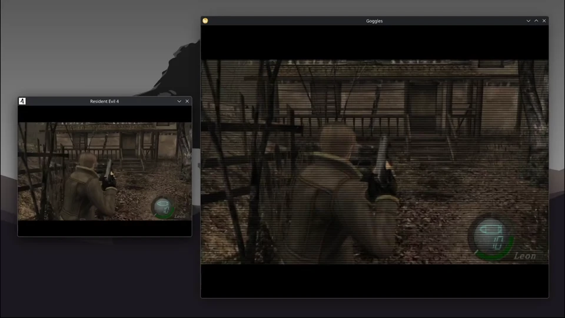
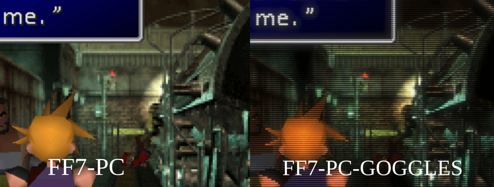

# Goggles

[](https://deepwiki.com/K1ngst0m/Goggles)

A hooking-based frame streaming tool with support for RetroArch shader processing.

| zfast-crt |
| :---: |
|  |

| crt-royale |
| :---: |
| |

Goggles captures Vulkan application frames and shares them across processes using Linux DMA-BUF with DRM format modifiers. 

```
┌────────────────────────────────────────────────────────────────────────┐
│                         Target Application                             │
│  ┌─────────────┐                                                       │
│  │  Swapchain  │ ◄── Application renders frames here                   │
│  │   Images    │                                                       │
│  └──────┬──────┘                                                       │
│         │ vkQueuePresentKHR (intercepted)                              │
│         ▼                                                              │
│  ┌─────────────────────────────────────────────────────────────────┐   │
│  │                    Capture Layer (vk_capture)                   │   │
│  │  ┌────────────┐    ┌────────────┐    ┌────────────────────────┐ │   │
│  │  │  Export    │    │  Copy to   │    │  Send via Unix Socket  │ │   │
│  │  │  Image     │◄───│  Export    │───►│  (SCM_RIGHTS)          │ │   │
│  │  │  (DMA-BUF) │    │  Image     │    │  fd + metadata         │ │   │
│  │  └────────────┘    └────────────┘    └────────────────────────┘ │   │
│  └─────────────────────────────────────────────────────────────────┘   │
└────────────────────────────────────────────────────────────────────────┘
                                    │
                                    │ Unix Domain Socket
                                    │ (DMA-BUF fd via SCM_RIGHTS)
                                    ▼
┌─────────────────────────────────────────────────────────────────────────┐
│                         Goggles Viewer                                  │
│  ┌──────────────────────────────────────────────────────────────────┐   │
│  │                    CaptureReceiver                               │   │
│  │  Receives fd + format + stride + modifier                        │   │
│  └──────────────────────────┬───────────────────────────────────────┘   │
│                             │                                           │
│                             ▼                                           │
│  ┌──────────────────────────────────────────────────────────────────┐   │
│  │                    VulkanBackend (import_dmabuf)                 │   │
│  │  ┌────────────┐    ┌────────────┐    ┌────────────────────────┐  │   │
│  │  │  Import    │    │  Create    │    │  Sample in             │  │   │
│  │  │  Memory    │───►│  VkImage   │───►│  Fragment Shader       │  │   │
│  │  │  (DMA-BUF) │    │            │    │                        │  │   │
│  │  └────────────┘    └────────────┘    └────────────────────────┘  │   │
│  └──────────────────────────────────────────────────────────────────┘   │
└─────────────────────────────────────────────────────────────────────────┘
```


The filter chain transforms captured DMA-BUF images through a series of shader passes before presenting to the display. It supports RetroArch `.slangp` preset files which define multi-pass post-processing effects (CRT simulation, scanlines, etc.).

```
┌─────────────┐     ┌──────────────┐     ┌──────────────┐     ┌───────────┐
│  Captured   │────▶│  FilterPass  │────▶│  FilterPass  │────▶│ Swapchain │
│  DMA-BUF    │     │   (Pass 0)   │     │   (Pass N)   │     │  Output   │
└─────────────┘     └──────────────┘     └──────────────┘     └───────────┘
                           │                    │
                           ▼                    ▼
                    ┌─────────────┐      ┌─────────────┐
                    │ Framebuffer │      │   (final)   │
                    │    (0)      │      │  no buffer  │
                    └─────────────┘      └─────────────┘
```

## Shader Preset Compatibility Database

### Status Key
* **Verified**: Manually inspected; visual output is perfect.
* **Partial**: Compiles and runs; full feature set or parameters pending review.
* **Untested**: Compiles successfully; requires human eyes for visual artifacts.

| Name | Build | Status | Platform | Notes |
| :--- | :--- | :--- | :--- | :--- |
| **crt/crt-royale.slangp** | Pass | Partial | `Mesa: RDNA3` | Full verification pending after the shader parameter controlling support. |
| **crt/zfast-crt.slangp** | Pass | Verified | `Mesa: RDNA3`, `Proprietary: Ada` | Verified; visual output matches expected quality on RDNA3. |

*More reports pending validation...*

## Build

This project uses [Pixi](https://pixi.sh) for dependency management and build tasks.

```bash
# Install dependencies (first time only)
pixi install

# Build (preset defaults to `debug`)
pixi run build [preset]         # 64-bit app + layer (e.g., release, asan, quality)
pixi run build-i686 [preset]    # 32-bit layer only
pixi run dev [preset]           # Build both layers + install manifests
pixi run tasks                  # Show Pixi task cheatsheet
pixi run goggles-help [preset]  # Build (if needed) and show goggles --help
pixi run shader-refresh         # Download/refresh RetroArch slang shaders
pixi run shader-list [pattern]  # List shader presets (optional filter)

# Test
pixi run test [preset]          # Run tests for preset

# IDE Setup (configure clang-format)
pixi run init                   # Check if IDE is configured
pixi run setup-ide              # Interactive IDE selection
pixi run setup-ide vscode       # Or specify: vscode/emacs/vim/neovim/clion

# Format (run before commit)
pixi run format                 # Format C/C++ and TOML files

# Run (builds via `dev` first)
pixi run start <app> [preset]   # e.g., pixi run start vkcube
```

Build output:
```
build/<preset>/
├── bin/goggles
├── lib/x86_64/libgoggles_vklayer.so
└── share/vulkan/implicit_layer.d/
```

## Usage

```bash
# Quick smoke test (build + manifests as needed)
pixi run start vkcube

# Standard flow
pixi run build                   # 1. Build the project
./build/debug/bin/goggles        # 2. Run goggles app (receiver)
GOGGLES_CAPTURE=1 vkcube         # 3. Run target app with capture enabled
```

For Steam games, set launch options:
```
GOGGLES_CAPTURE=1 %command%
```

### System-wide Usage

Once the layer manifests are installed (via `pixi run install-manifests` or `pixi run dev`), the Goggles capture layer becomes available to all Vulkan applications on your system, even outside the Pixi environment.

```bash
# Enable capture for any system application
GOGGLES_CAPTURE=1 /usr/bin/vkcube
```

### RetroArch Shaders

The repository tracks minimal zfast-crt shaders. For the full shader collection:

```bash
pixi run shader-refresh          # Download/refresh full RetroArch shaders into shaders/retroarch
pixi run shader-list [pattern]   # List available .slangp presets (optional filter)
```

This downloads from [libretro/slang-shaders](https://github.com/libretro/slang-shaders). All shaders except zfast-crt are gitignored.

## Documentation

See [docs/architecture.md](docs/architecture.md) for project architecture and design.

Topic-specific docs:
- [Threading](docs/threading.md) - Concurrency model and job system
- [DMA-BUF Sharing](docs/dmabuf_sharing.md) - Cross-process GPU buffer sharing
- [Filter Chain](docs/filter_chain_workflow.md) - RetroArch shader pipeline
- [RetroArch](docs/retroarch.md) - Shader preset compatibility
- [Shader Compatibility Report](docs/shader_compatibility.md) - Full compilation status for all RetroArch presets
- [Project Policies](docs/project_policies.md) - Development rules and conventions
- [Roadmap](ROADMAP.md) - Development pending work
