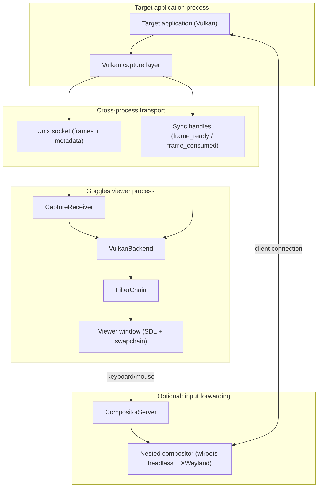

# Goggles Architecture

## Purpose

High-level overview of the Goggles codebase for maintainers. Start here to understand how the system is structured before diving into topic-specific docs.

## System Context

Goggles captures frames from Vulkan applications and applies real-time shader effects before display.



## Module Overview

### `src/capture/` - Frame Capture

**Responsibility:** Intercept frames from target applications and deliver to the Goggles app.

| Component | Purpose |
|-----------|---------|
| `vk_layer/` | Vulkan layer injected into target app |
| `capture_receiver.*` | App-side socket receiver |
| `capture_protocol.hpp` | IPC message format |

**Key constraint:** Layer code runs in the target app's process. Must be minimal, no blocking, C API only.

See: [dmabuf_sharing.md](dmabuf_sharing.md)

### `src/render/` - Rendering Pipeline

**Responsibility:** Import captured frames, apply shader effects, present to display.

| Component | Purpose |
|-----------|---------|
| `backend/` | Vulkan device, swapchain, resource management |
| `shader/` | Slang compilation, RetroArch preset parsing |
| `chain/` | Multi-pass filter chain execution |

**Key pattern:** Filter chain applies RetroArch-compatible shader presets (`.slangp` files) as a sequence of render passes.

See: [filter_chain_workflow.md](filter_chain_workflow.md), [retroarch.md](retroarch.md)

### `src/util/` - Utilities

**Responsibility:** Common infrastructure used across modules.

| Component | Purpose |
|-----------|---------|
| `error.hpp` | `tl::expected` error types |
| `logging.*` | spdlog wrapper |
| `config.*` | TOML configuration |
| `job_system.*` | Thread pool wrapper |
| `queues.hpp` | Lock-free SPSC queue |
| `unique_fd.hpp` | RAII file descriptor |

See: [threading.md](threading.md)

### `src/app/` - Application Entry

**Responsibility:** Initialize subsystems, run main loop, handle window events.

## Data Flow

```
1. Target app renders frame
   └─▶ present call intercepted by capture layer

2. Capture layer exports swapchain image as DMA-BUF
   └─▶ Sends fd + metadata over Unix socket
   └─▶ Signals frame_ready timeline semaphore

3. Goggles app receives DMA-BUF
   └─▶ Waits on frame_ready semaphore (GPU sync)
   └─▶ CaptureReceiver imports into VulkanBackend

4. Filter chain processes frame
   └─▶ Pass 0 → Pass 1 → ... → Pass N (shader effects)

5. Final pass renders to swapchain
   └─▶ Signals frame_consumed semaphore (back-pressure)
   └─▶ Displayed on screen

6. Capture layer waits on frame_consumed before next frame
   └─▶ Prevents overwriting frame still in use
```

## Key Design Decisions

| Decision | Rationale |
|----------|-----------|
| Vulkan layer injection | Zero-copy frame access, works with any Vulkan app |
| DMA-BUF sharing | GPU-to-GPU transfer without CPU copies |
| Timeline semaphore sync | Cross-process GPU synchronization without CPU polling |
| RetroArch shader format | Leverage existing shader ecosystem |
| Single-threaded render loop | Simplicity; threading added only when profiling justifies |
| C API in layer, C++ in app | Layer must be minimal; app benefits from type safety |

## Topic Docs

- [Threading](threading.md) - Concurrency model, job system, SPSC queues
- [DMA-BUF Sharing](dmabuf_sharing.md) - Cross-process GPU buffer protocol
- [Filter Chain](filter_chain_workflow.md) - Multi-pass shader pipeline
- [RetroArch](retroarch.md) - Shader preset format and compatibility
- [Project Policies](project_policies.md) - Coding standards, error handling, ownership rules
