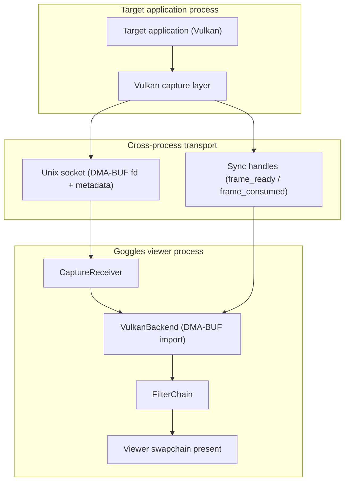
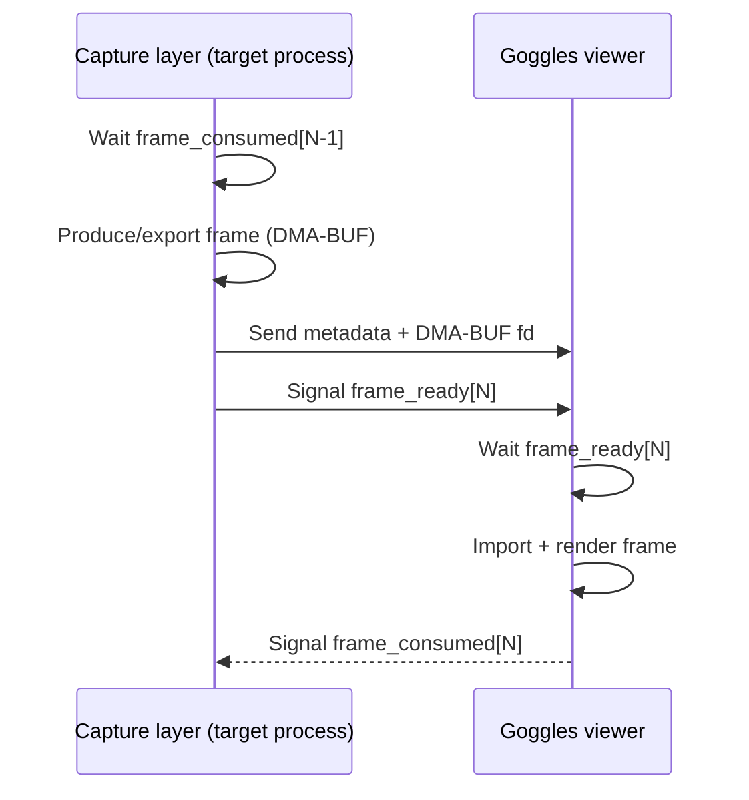

# DMA-BUF Cross-Process Sharing

> **Components:** Capture Layer (vk_capture), Render Backend (VulkanBackend), IPC (CaptureReceiver)

This document explains how Goggles shares GPU textures between processes using Linux DMA-BUF with DRM format modifiers and timeline semaphore synchronization.

**Key Technologies:**
- **DMA-BUF:** Linux kernel mechanism for sharing GPU buffers between processes
- **DRM Format Modifiers:** Metadata describing GPU-specific memory layouts (tiling, compression)
- **Timeline Semaphores:** Cross-process GPU synchronization without CPU polling

---

## 1. Architecture Overview

---

## 2. Why DRM Format Modifiers?

GPU memory is not always laid out linearly. Modern GPUs use various tiling patterns and compression schemes:

- **Linear:** Simple row-major layout
- **Tiled:** GPU-specific tile patterns (AMD 64KB tiles, Intel Y-tiling)
- **Compressed:** Delta Color Compression (DCC), etc.

When sharing GPU buffers across processes, both sides must agree on the memory layout. DRM format modifiers are 64-bit values that encode the exact memory layout:

| Modifier Value | Meaning |
|----------------|---------|
| `0x0` | `DRM_FORMAT_MOD_LINEAR` (universal) |
| `0x200000020801b04` | AMD vendor-specific tiling |
| `0x100000000000001` | Intel Y-tiling |

By exchanging the modifier value via IPC, both processes can create compatible images.

---

## 3. Export/Import Flow

**Export (Capture Layer):**
1. Query supported modifiers for the swapchain format
2. Create export image with list-based modifier selection (driver chooses optimal)
3. Query the actual modifier selected by driver
4. Export DMA-BUF file descriptor via `vkGetMemoryFdKHR`
5. Send fd, format, dimensions, stride, modifier via Unix socket

**Import (Render Backend):**
1. Receive metadata from IPC
2. Create image with explicit modifier (matching exporter's layout)
3. Query dedicated allocation requirements (vendor modifiers often require it)
4. Import memory via `VkImportMemoryFdInfoKHR`
5. Bind memory and create image view for shader sampling

---

## 4. Required Vulkan Extensions

### Export Side (Capture Layer)

| Extension | Purpose |
|-----------|---------|
| `VK_EXT_image_drm_format_modifier` | Create images with modifier tiling |
| `VK_KHR_external_memory_fd` | Export memory as file descriptor |
| `VK_EXT_external_memory_dma_buf` | DMA-BUF handle type support |

### Import Side (Render Backend)

| Extension | Purpose |
|-----------|---------|
| `VK_EXT_image_drm_format_modifier` | Create images with modifier tiling |
| `VK_KHR_image_format_list` | Required dependency for modifier ext |
| `VK_KHR_external_memory_fd` | Import memory from file descriptor |
| `VK_EXT_external_memory_dma_buf` | DMA-BUF handle type support |

---

## 5. Common Issues

| Error | Cause | Solution |
|-------|-------|----------|
| `VK_ERROR_INVALID_DRM_FORMAT_MODIFIER_PLANE_LAYOUT_EXT` | Invalid plane layout (e.g., `rowPitch = 0`) | Export: use list-based creation. Import: use explicit with correct stride. |
| `requiresDedicatedAllocation` validation error | Vendor modifiers require dedicated allocation | Query `VkMemoryDedicatedRequirements` and add `VkMemoryDedicatedAllocateInfo`. |
| Format doesn't support LINEAR tiling | Some formats incompatible with LINEAR + certain usage | Use DRM format modifiers instead of hardcoded LINEAR. |

---

## 6. Cross-Process Semaphore Synchronization

Timeline semaphores enable GPU-to-GPU synchronization without CPU polling.

### Why Timeline Semaphores?

Binary semaphores require one-to-one signal/wait pairing. Timeline semaphores use monotonically increasing counter values, enabling:
- **Back-pressure:** Capture waits for receiver to consume previous frame
- **Non-blocking checks:** Host can query value without blocking
- **Cross-process sharing:** Same semaphore instance shared via file descriptor

### Semaphore Protocol

| Semaphore | Signaled By | Waited On By | Purpose |
|-----------|-------------|--------------|---------|
| `frame_ready` | Capture layer | Goggles viewer | Frame data ready for sampling |
| `frame_consumed` | Goggles viewer | Capture layer | Frame rendered (back-pressure) |

**Synchronization flow:**

### Required Extensions

| Extension | Purpose |
|-----------|---------|
| `VK_KHR_timeline_semaphore` | Timeline semaphore semantics |
| `VK_KHR_external_semaphore` | Enable semaphore sharing |
| `VK_KHR_external_semaphore_fd` | Export/import via file descriptor |

---

## 7. Capture Modes

### Comparison

| Aspect | Default Mode | WSI Proxy Mode |
|--------|--------------|----------------|
| **Activation** | `GOGGLES_CAPTURE=1` | `GOGGLES_CAPTURE=1 GOGGLES_WSI_PROXY=1` |
| **Window** | Real X11/Wayland displayed | No window (virtual) |
| **Swapchain** | Real driver images | DMA-BUF exportable from creation |
| **GPU Copy** | Required (swapchain → export) | None (direct export) |
| **Sync** | Timeline semaphores + async worker | Inline IPC, FPS-limited |
| **Use Case** | Real-time display + capture | Headless capture only |

### WSI Proxy Environment Variables

| Variable | Default | Description |
|----------|---------|-------------|
| `GOGGLES_WIDTH` | 1920 | Virtual surface width |
| `GOGGLES_HEIGHT` | 1080 | Virtual surface height |
| `GOGGLES_FPS_LIMIT` | 60 | Frame rate limit at acquire |

---

## 8. References

- [VK_EXT_image_drm_format_modifier](https://registry.khronos.org/vulkan/specs/1.3-extensions/man/html/VK_EXT_image_drm_format_modifier.html)
- [VK_KHR_timeline_semaphore](https://registry.khronos.org/vulkan/specs/1.3-extensions/man/html/VK_KHR_timeline_semaphore.html)
- [VK_KHR_external_semaphore](https://registry.khronos.org/vulkan/specs/1.3-extensions/man/html/VK_KHR_external_semaphore.html)
- [Linux DRM Format Modifiers](https://docs.kernel.org/gpu/drm-kms.html#format-modifiers)
- [DMA-BUF Sharing](https://docs.kernel.org/driver-api/dma-buf.html)
