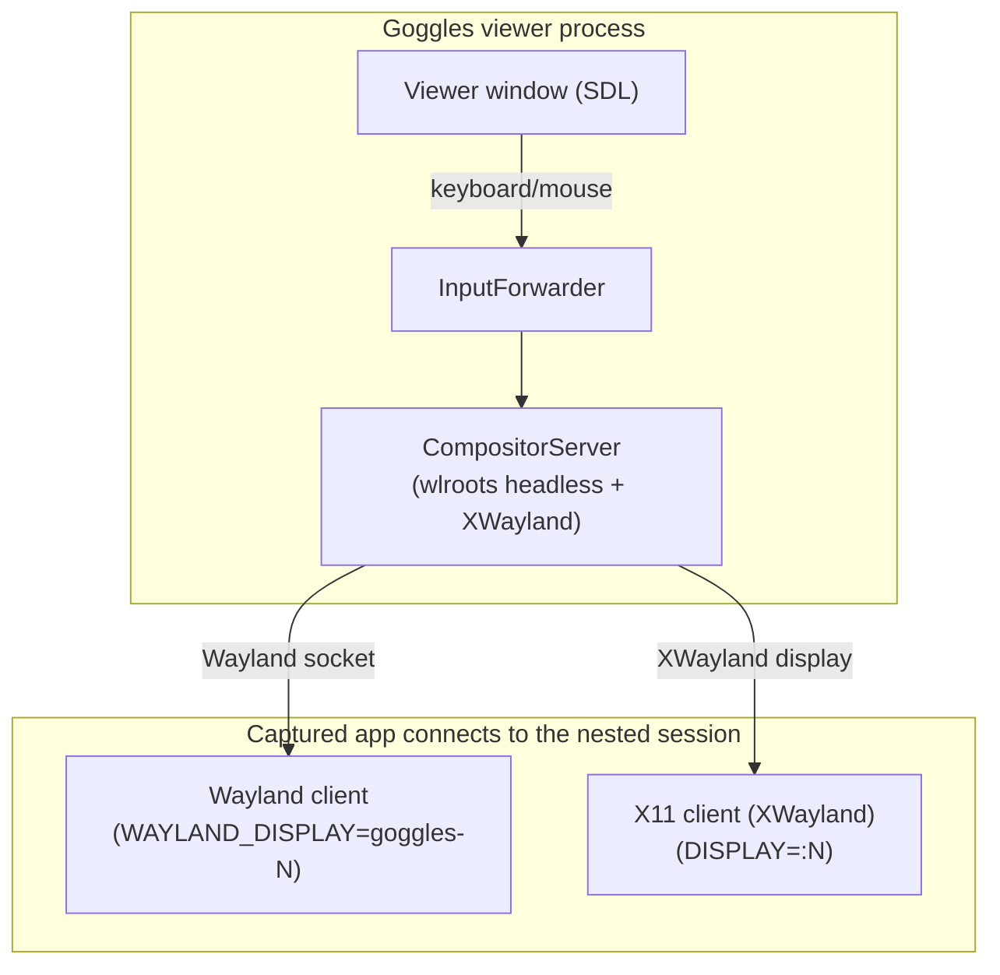
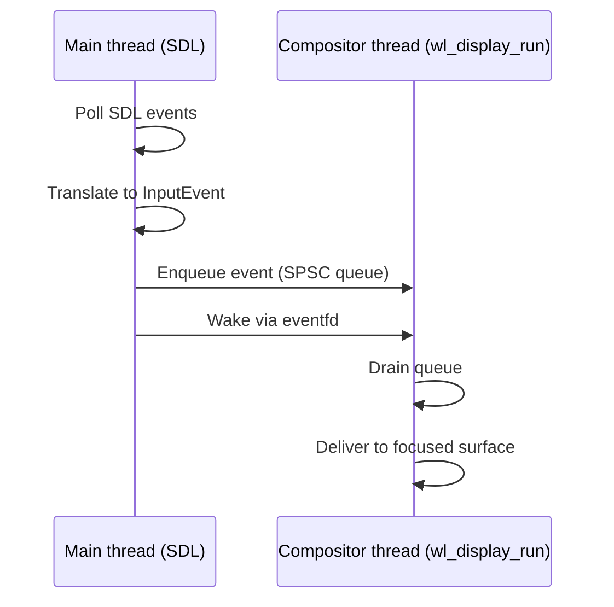

# Input Forwarding

## Purpose

Explains how Goggles forwards input (keyboard, mouse) from the viewer window to captured applications without requiring window focus switching. Supports both X11 (via XWayland) and native Wayland applications.

## Problem

When capturing frames from a Vulkan application via the layer, the app typically runs headless (no visible window). Users want to control the captured app by pressing keys in the Goggles viewer window, but standard input methods don't work because:

1. The captured app is on a different display server
2. X11/Wayland don't forward events between unrelated windows
3. Synthetic events (XTest, uinput) are filtered by many applications (especially Wine)

## Solution Architecture

### Component Overview



### Unified Input via wlr_seat

The compositor uses wlroots' `wlr_seat_*` APIs to deliver input to focused surfaces:

- **Keyboard**: `wlr_seat_keyboard_notify_key()` sends key events
- **Pointer**: `wlr_seat_pointer_notify_motion/button/axis()` sends pointer events
- **Frame**: `wlr_seat_pointer_notify_frame()` groups related events

For XWayland apps, `wlr_xwayland_set_seat()` connects the seat to XWayland. The wlr_xwm (X Window Manager) automatically translates seat events to X11 KeyPress/KeyRelease and ButtonPress/MotionNotify events.

### Why Headless wlroots?

The nested Wayland compositor uses `wlr_headless_backend_create()` which:

- Creates Wayland sockets (`goggles-N`, `DISPLAY=:N`) without requiring GPU/display
- Doesn't conflict with the host compositor (Wayland/X11)
- Provides the minimal infrastructure for XWayland and native Wayland clients
- No actual composition or rendering happens

## Data Flow

### Initialization

1. **Goggles starts** → `goggles::input::InputForwarder::create()`
2. **Create headless Wayland compositor** on `goggles-N` socket
3. **Create seat** with keyboard and pointer capabilities
4. **Start XWayland** on DISPLAY=:N
5. **Connect XWayland to seat** via `wlr_xwayland_set_seat()`
6. **Register eventfd** for cross-thread input marshaling

### Runtime

1. **User presses W key** in Goggles SDL window
2. **SDL generates SDL_EVENT_KEY_DOWN** with scancode
3. **InputForwarder receives event** via SDL event loop
4. **Translate scancode** to Linux keycode (evdev)
5. **Push event to SPSCQueue** + write to eventfd
6. **Compositor thread wakes**, drains queue
7. **wlr_seat_keyboard_notify_key()** dispatches to focused surface
8. **For Wayland apps**: wl_keyboard.key sent directly
9. **For X11 apps**: wlr_xwm translates to X11 KeyPress/KeyRelease
10. **App processes input** as if from physical keyboard

### Shutdown

1. **Goggles exits** → terminate compositor
2. **Stop compositor event loop**
3. **Destroy XWayland, seat, backend**
4. **Close eventfd and cleanup**

## Key Design Decisions

| Decision | Rationale |
|----------|-----------|
| Unified wlr_seat_* API | Single code path for both X11 and Wayland apps |
| wlr_xwm for X11 translation | Proven wlroots component, no XTest dependency |
| SPSCQueue + eventfd | Lock-free cross-thread marshaling per project policy |
| Headless wlroots backend | No GPU/display conflict with host compositor |
| Auto-focus first surface | Focuses the first eligible surface |

## Thread Model



## Limitations

### Current Implementation

- **Basic mouse support**: Mouse button, motion, and wheel events forwarded. Coordinate mapping is 1:1 (no scaling).
- **Limited keycode map**: Common keys (A-Z, 0-9, ESC, Enter, Space, arrows, modifiers) mapped.
- **No modifier state tracking**: Shift/Ctrl/Alt forwarded as key events but state not synchronized.
- **Single app focus**: Auto-focuses first eligible surface (MVP).
- **XWayland surface cleanup**: No destroy listener for XWayland surfaces (fires unexpectedly). Stale pointers cleared during focus transitions.

### Focus Transition Behavior

- **Wayland app steals focus from X11**: When launching a Wayland app after an X11 app, focus automatically transfers. The X11 app's surface pointer may be stale (freed by wlroots) but is safely cleared.
- **X11 app does NOT steal focus from Wayland**: XWayland surfaces only gain focus if no surface is currently focused.

### Wayland Focus Timing

Wayland keyboard focus is granted after the client acks the initial xdg-shell configure (`xdg_surface.ack_configure`). This avoids gating focus on wlroots' `surface->events.map`, which may never occur for some Wayland-native Vulkan apps under WSI proxy mode (`GOGGLES_WSI_PROXY=1`).

### Future Enhancements

1. **Full keyboard map**: Complete SDL → Linux scancode translation
2. **Modifier state synchronization**: Track and sync Shift/Ctrl/Alt/Super state
3. **Mouse coordinate mapping**: Scale/transform coordinates for different window sizes
4. **Multi-app focus**: Input routing to specific windows

## Dependencies

Dependencies are provided by the Pixi environment (see `pixi.toml`) and a pinned wlroots package:

| Library | Version | Purpose |
|---------|---------|---------|
| wlroots | 0.18 | Wayland compositor library (headless backend, seat, XWayland) |
| wayland-server | Pixi | Wayland protocol server implementation |
| xkbcommon | Pixi | Keyboard keymap handling for Wayland |
| SDL3 | Pixi | Viewer window input source |

**Note:** We do not inject via XTest/uinput. X11 clients receive input via wlroots' XWayland integration (`wlr_xwm` translating seat events to X11 events).

## Environment Variables

### Launching Captured Apps

| Variable | Example | Purpose |
|----------|---------|---------|
| `DISPLAY` | `:1` | Connect X11 app to XWayland (printed by Goggles on startup) |
| `WAYLAND_DISPLAY` | `goggles-0` | Connect Wayland app to nested compositor (printed by Goggles on startup) |

For X11 apps (including Wine):
```bash
WAYLAND_DISPLAY= DISPLAY=:1 ./my_x11_app
```

For Wayland-native apps:
```bash
WAYLAND_DISPLAY=goggles-0 ./my_wayland_app
```

## Testing

### Manual Test

```bash
# Terminal 1: Start Goggles
./build/debug/bin/goggles --input-forwarding

# Terminal 2: Start test app inside the nested session
# Replace :1 / wayland-1 with values printed by Goggles

# For X11 backend test:
WAYLAND_DISPLAY= DISPLAY=:1 GOGGLES_CAPTURE=1 ./build/debug/tests/goggles_manual_input_x11

# For Wayland backend test:
WAYLAND_DISPLAY=goggles-0 GOGGLES_CAPTURE=1 ./build/debug/tests/goggles_manual_input_wayland

# Focus Goggles window, press keys/move mouse
# test_app terminal should show input events
```

For a Wayland-native Vulkan app under WSI proxy (protocol focus sanity check):
```bash
DISPLAY=:1 WAYLAND_DISPLAY=goggles-0 WAYLAND_DEBUG=client GOGGLES_WSI_PROXY=1 GOGGLES_CAPTURE=1 \
  /home/kingstom/workspaces/vksdk/1.4.321.1/x86_64/bin/vkcube
```

### Verify XWayland Running

```bash
# Should show XWayland process on :N
ps aux | grep Xwayland

# Check nested display connections
DISPLAY=:1 xdotool search --class test
```

## See Also

- [Wayland + wlroots Input Primer](wayland_wlroots_input_primer.md) - Concepts and code map for maintainers
- [Architecture](architecture.md) - System overview
- [DMA-BUF Sharing](dmabuf_sharing.md) - How frames are captured
- [Project Policies](project_policies.md) - Coding standards
