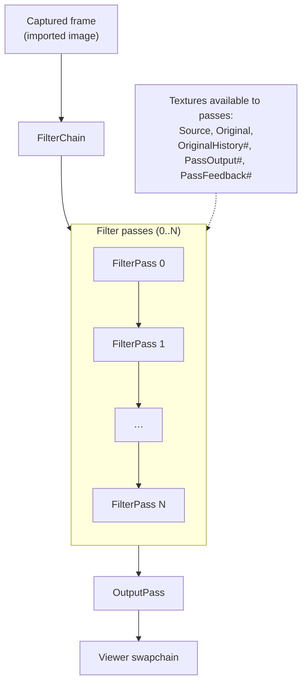
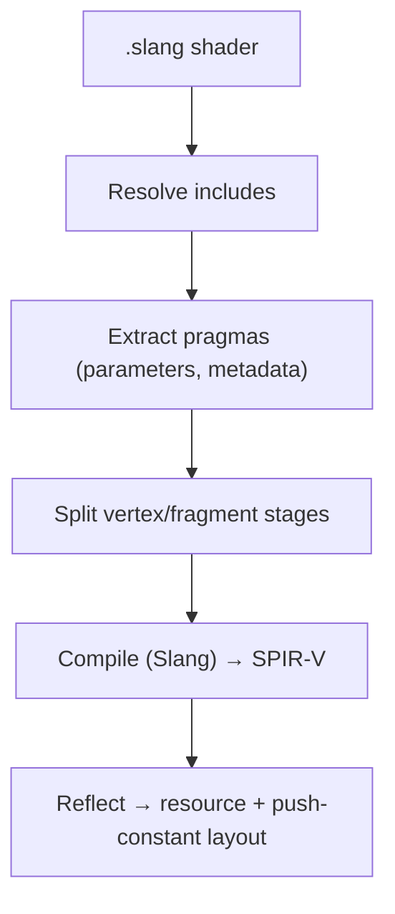

# RetroArch Shader Support

## Purpose

Explains Goggles' compatibility with RetroArch shader presets (`.slangp` files), enabling CRT filters, scanlines, and other post-processing effects from the RetroArch ecosystem.

## Overview



A filter chain is a sequence of shader passes. Each pass:
- Renders a fullscreen quad applying shader effects
- Can access any previous pass output
- Can access the original captured frame

## Key Concepts

### Preset Format (`.slangp`)

```ini
shaders = 2

shader0 = shaders/pass0.slang
scale_type0 = source
scale0 = 2.0
filter_linear0 = false

shader1 = shaders/final.slang
# No scale = outputs to backbuffer
```

### Shader Format (`.slang`)

RetroArch uses Vulkan GLSL with custom pragmas:

```glsl
#version 450

layout(push_constant) uniform Push {
    vec4 SourceSize;
    vec4 OutputSize;
    uint FrameCount;
} params;

#pragma parameter BRIGHTNESS "Brightness" 1.0 0.5 2.0 0.05

#pragma stage vertex
void main() { /* vertex shader */ }

#pragma stage fragment
void main() { /* fragment shader */ }
```

### Standard Semantics

| Semantic | Type | Description |
|----------|------|-------------|
| `SourceSize` | vec4 | `[width, height, 1/width, 1/height]` of input |
| `OutputSize` | vec4 | Output dimensions |
| `OriginalSize` | vec4 | Original captured frame size |
| `FrameCount` | uint | Frame counter for animations |
| `MVP` | mat4 | Model-View-Projection matrix |
| `Source` | sampler2D | Previous pass output (or original for pass 0) |
| `Original` | sampler2D | Original captured frame |
| `OriginalHistory#` | sampler2D | Previous frames (e.g., `OriginalHistory1` is 1 frame ago) |
| `PassOutput#` | sampler2D | Output of pass `#` (for referencing earlier passes) |
| `PassFeedback#` | sampler2D | Feedback buffer for pass `#` (previous frame output) |

## Key Components

| Component | Location | Purpose |
|-----------|----------|---------|
| PresetParser | `src/render/chain/preset_parser.*` | Parse `.slangp` files |
| RetroArchPreprocessor | `src/render/shader/retroarch_preprocessor.*` | Split stages, extract parameters |
| ShaderRuntime | `src/render/shader/shader_runtime.*` | Compile GLSL to SPIR-V (via Slang) |
| FilterPass | `src/render/chain/filter_pass.*` | Render single pass |
| FilterChain | `src/render/chain/filter_chain.*` | Orchestrate multi-pass rendering |
| SemanticBinder | `src/render/chain/semantic_binder.hpp` | Populate UBO/push constants |

## Compiler Strategy

**Decision:** Use Slang compiler with GLSL mode (not glslang).

**Rationale:**
- Single compiler for both native HLSL and RetroArch GLSL shaders
- Slang is actively maintained by NVIDIA/Khronos
- Avoids maintaining two compiler integrations

**Processing Pipeline:**


## Usage Example

See `docs/filter_chain_workflow.md` for the render-loop flow and how presets map to passes.

## Current Limitations

- No runtime parameter adjustment UI

## References

- [docs/filter_chain_workflow.md](filter_chain_workflow.md) - Filter chain execution details
- [RetroArch Slang spec](https://docs.libretro.com/development/shader/slang-shaders/)
- [slang-shaders repo](https://github.com/libretro/slang-shaders) - Shader collection
